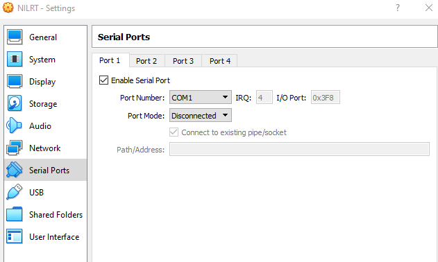

# NI Linux RT Installation

## Generate NI Linux RT USB

- Open the NI MAX

  

- Select the image to flash to the USB.

  
  > For using LV 2020, that uses the recovery image 8.0, the maximum allowed intel generation, in DELL computers, is the
  > 10th generation. This recovery version 8.0 is not compatible with newer intel versions, tested **only** in DELL machines.
  > If a DELL computer with higher intel chip is used the LV image for 2023 Q1 must be used (23.0), this is compatible
  > with LV 2020 as well.

## BIOS Config

For installing the recovery image the BIOS must be set accordingly:

- Boot mode set to UEFI
- Disable secure BOOT
- Disable RAID for better compatibility and ensure hard drive detection

  

## After using the USB

Install real time packages from the NI MAX.

- Install RT image

  

- Select programming environment

  

- Install required packages

  

- Set SSH password

  

## After installation to set as PXI

Define the system as a PXI.

- Log into the machine and type the following commands
  - Set as PXI

    ```bash
    grub-editenv - set TargetClass=PXI
    grub-editenv - set DeviceCode=0x77E1
    grub-editenv - set NITarget=true
    ```

  - Define desired device description

    ```bash
    grub-editenv - set DeviceDesc=PXIe-8880_Dell
    ```

  - Define desired host name

    ```bash
    grub-editenv - set hostname=ats_AXES-PXI
    ```

  - Reboot to apply the changes

- Check the settled configuration command

  ```bash
  fw_printenv
  ```

- Example configuration

  ```bash
  admin@NI-cRIO-903x-VM-e50e7166:~# grub-editenv - set TargetClass=PXI
  admin@NI-cRIO-903x-VM-e50e7166:~# grub-editenv - set DeviceCode=0x77E1
  admin@NI-cRIO-903x-VM-e50e7166:~# grub-editenv - set DeviceDesc=PXIe-8880_Dell
  admin@NI-cRIO-903x-VM-e50e7166:~# grub-editenv - set hostname=ats_TMA-PXI
  admin@NI-cRIO-903x-VM-e50e7166:~# grub-editenv - set NITarget=true
  admin@NI-cRIO-903x-VM-e50e7166:~# fw_printenv
  serial#=e50e7166
  DeviceCode=0x77E1
  DeviceDesc=PXIe-8880_Dell
  TargetClass=PXI
  BIOSBootMode=efi
  NITarget=true
  primaryethaddr=CC96E50E7166
  hostname=ats_TMA-PXI
  safemodeenabled=False
  admin@NI-cRIO-903x-VM-e50e7166:~# reboot
  ```

  after the reboot

  ```bash
  admin@ats_TMA-PXI:~# fw_printenv
  serial#=e50e7166
  DeviceCode=0x77E1
  DeviceDesc=PXIe-8880_Dell
  TargetClass=PXI
  BIOSBootMode=efi
  NITarget=true
  primaryethaddr=CC96E50E7166
  hostname=ats_TMA-PXI
  safemodeenabled=False
  ```

## Discover the target from the LV project

After setting the target as a PXI, the new target appears as a PXI target in the project and the NI MAX.


## After installation to set as cRIO

Define the system as a cRIO.

- Log into the machine and type the following commands
  - Set as PXI

    ```bash
    grub-editenv - set TargetClass=cRIO
    grub-editenv - set DeviceCode=0x7735
    ```

  - Define desired device description

    ```bash
    grub-editenv - set DeviceDesc=cRIO-903x-VM
    ```

  - Define desired host name

    ```bash
    grub-editenv - set hostname=name
    ```

  - Reboot to apply the changes

## Installation on a Virtual Box VM

### Creating a Virtual Machine for NI Linux RT

- Choose Linux as Type and Ubuntu (64-bit) as version

  

- Choose 1024 or 2048 as your memory size (this can be changed later if needed)

  

- Choose to create a virtual hard drive (at least 4 GB)

  

- Choose VDI as your hard disk type

  

- Choose Dynamically allocated as how the data is stored (both options will work, this takes less space on your host system)

  

- Once the virtual machine has been created, copy the image from
  `C:\\Program Files (x86)\\National Instruments\\RT Images\\Utilities\\Linux RT PXI Safemode\\8.0` called
  standard_x64_recovery.iso to your virtualbox workspace (this is strictly not necessary, however I prefer to do this in
  case the image get corrupted during the install process, we have a backup and don't have to reinstall the
  LabVIEW Real Time Module)
  

### Configuring the Virtual Machine

- Select your virtual machine (NILRT in my case) and click on the settings gear
- Go to settings -> system -> Motherboard and check the box "Enable EFI (Special OSes only)

  

- Go to Settings -> Storage and select the optical storage device

  

- Click the options menu of the optical drive in the top right corner (little blue "wheel") and select the option "Choose a disk file"

  

- Navigate to where you have stored your NILRT recovery iso file and select it

  
  

- Go to network and in the adapter 1 tab, select the `Enable Network Adapter` checkbox (usually selected by default)
- Choose `Attached to: Bridged Adapter` and select your main network card as the Name

> If you want to use a bridged connection at CERN, your virtual Ethernet adapter has to be registered in netops,
> if not use a Host-only Adapter connection instead please see
> [**this guide**](https://readthedocs.web.cern.ch/display/MTA/%5BNILRT%5D+Virtual+Box+Host+Only+Adapter) for
> setting up a host only adapter

  

- Expand the advanced menu and select the Intel PRO/1000 MT Desktop as your Adapter type (usually the default one.
  NI ships most of their controllers with Intel based hardware)

  

- Select the settings -> Serial Ports -> Port 1 tab
- Check the box `Enable Serial Port`
  - This is needed for one of the hardware authentication steps in the NILRT installer and will fail if not enabled

  

- Select **USB 3.0 as your USB controller** (USB keyboards and other USB based peripherals will not work unless you do this)

  

### Installing NILRT from the ISO

- DoubleClick or hit the `start` arrow to run the machine

  

- Select the ISO as your startup drive/disk

  

- choose "y" (yes) when the installer prompts you if you want to continue

  

> If you are using a USB based keyboard, the installer might refuse to take any keyboard inputs at this step. If this
> happens, right click the USB icon in the down right corner of your NILRT virtual machine window and select your keyboard.
> This is only needed during the installation and can be unchecked on the next reboot (once the system is installed)

  

- When the process finishes, it will ask you to restart the machine:

  

- After restarting you'll get the following screen:

  

- That's it, the system should now be discoverable from MAX and you can install all drivers from there.

> If the system is discoverable but you're not allowed to install, it might be because the network configuration in
> virtualbox is not correct.

- From NI MAX -> Remote systems -> Your remote device -> Open the device submenu clicking on the arrow ->
  Right click on `Software` -> Click on Add/Remove Software

  

- If the credentials screen opens, the default user is "admin" and leave password empty. Click enter to proceed to the
  following screen

  

- Select the OS to install:

  

- Wait for this to finish and restart

  
  

- Selected software to install by default:

  - CompactRIO Support.
  - LabVIEW Real-Time.
  - NI Web-Based Configuration and Monitoring
  - NI Wireless Certificate Management Web Service
  - NI-VISA

  
  
  
  
  
  

- Done, a cRIO system is installed in a VM, to change the system to be a PXI, go to [this section](#after-installation-to-set-as-pxi)
